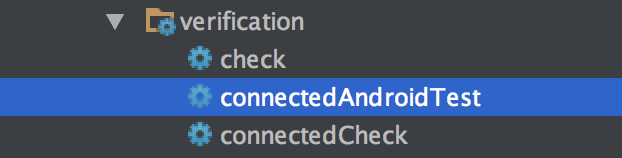
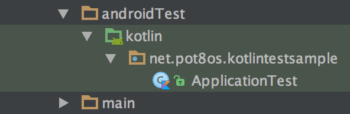
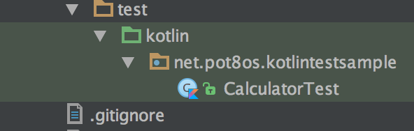

# Kotlin-Espresso-Sample

## Run tests

You have to have a connected device in advance in order to run `UI tests`. It doesn't matter if it's a simulator and a real one.

### Using Android Studio

|   |UI Tests (using Espresso)|Unit Tests (using JUnit4)|
|---|----------------------|-----------------------|
|Gradle task name|`connectedAndroidTest`  |`testDebugUnitTest`  |
|Location of test code|`src/androidTest/kotlin` |`src/test/kotlin` |
|Prefix of dependencies defined in `build.gradle`|`androidTestCompile`|`testCompile`|
